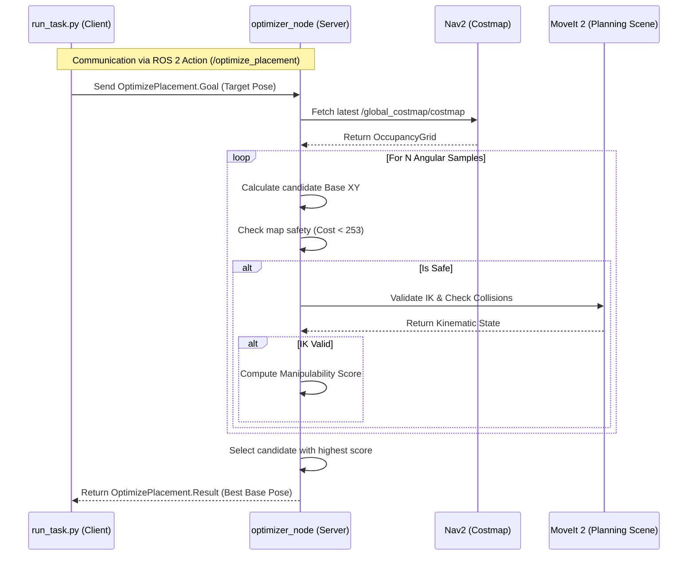
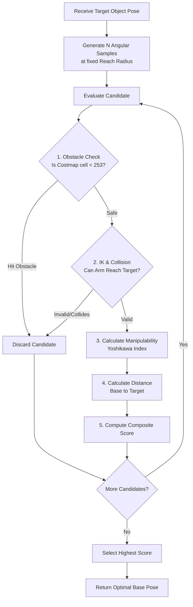

# Base Placement Optimizer: Architectural Deep Dive & Usage

The `base_placement_optimizer` package solves a critical problem in mobile manipulation: **Where should the robot park its mobile base so the robotic arm can safely and optimally reach a target object?**

This document details how the system achieves this using a distributed ROS 2 Action Server/Client architecture, and how to run the provided examples.

## 1. System Architecture

The optimizer operates as a standalone C++ Action Server (`optimizer_node`). It remains idle until a client (like `run_task.py` or a Behavior Tree node) requests an optimal placement over the ROS 2 DDS network. 



## 2. Optimization Algorithm

When a goal is received, the C++ node executes a fast, multi-stage filtering algorithm to find the best parking spot.



### The Scoring Metric
If a candidate survives the Obstacle and IK checks, it is scored using a weighted combination:

1. **Manipulability (Yoshikawa Index)**: Ensures the arm is in a dexterous, comfortable configuration, avoiding singularities (where the arm locks up) and extreme stretching.
   $$ w = \sqrt{\det(J \cdot J^T)} $$
2. **Distance**: Penalizes positions that are unnecessarily far away.

The final composite score is calculated as:
`Score = (alpha * Manipulability) + ((1 - alpha) * Distance Score)`

## 3. The ROS 2 Action Interface

The contract between the Client and Server is defined in `action/OptimizePlacement.action`. Because it is an action (not a service), the optimizer runs asynchronously and can provide feedback or be canceled mid-computation.

```yaml
# Goal: Where is the object we want to reach?
geometry_msgs/PoseStamped target_pose
---
# Result: Where should the robot park, and how good is it?
bool success
string error_reason
geometry_msgs/PoseStamped base_pose
float32 manipulability_score
float32 path_distance
float32 composite_score
---
# Feedback: What is the optimizer currently doing?
string current_phase
```

## 4. Running the Example (`run_task.py`)

To see the optimizer in action, you can run the full demo launch file and the provided Python example script.

### Step 1: Launch the Demo Environment
This launch file brings up Gazebo, Nav2, MoveIt2, and the Base Placement Optimizer Action Server.

```bash
# Build the workspace if you haven't already
colcon build --symlink-install --packages-select base_placement_optimizer

# Source the workspace
source install/setup.bash

# Launch the demo
ros2 launch base_placement_optimizer optimizer_demo.launch.py
```

### Step 2: Run the Example Script
In a new terminal, run the Python client script. This script executes a full end-to-end task:
1. **Stows the arm** for safe navigation.
2. **Calls the Optimizer** to find the best parking spot for a hardcoded target coordinate.
3. **Navigates** the mobile base to the calculated XY coordinate.
4. **Aligns the heading** using a custom P-controller for smooth rotation.
5. **Reaches for the target** using MoveIt2.

```bash
# Source the workspace
source install/setup.bash

# Run the task client
ros2 run base_placement_optimizer run_task.py
```

You will see the robot intelligently navigate to an optimal position and reach for the target coordinate.
